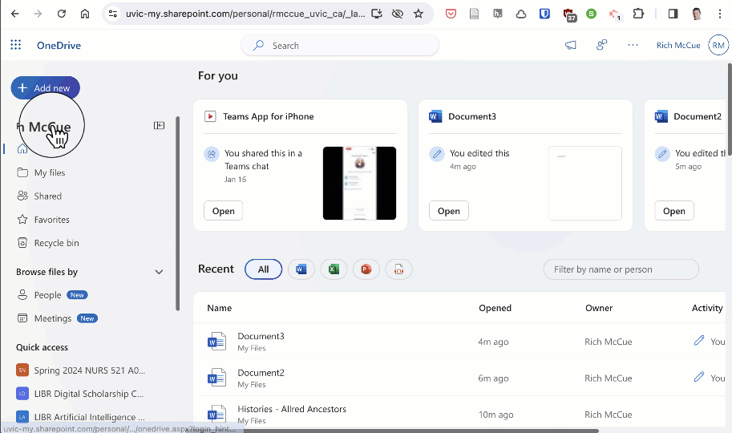
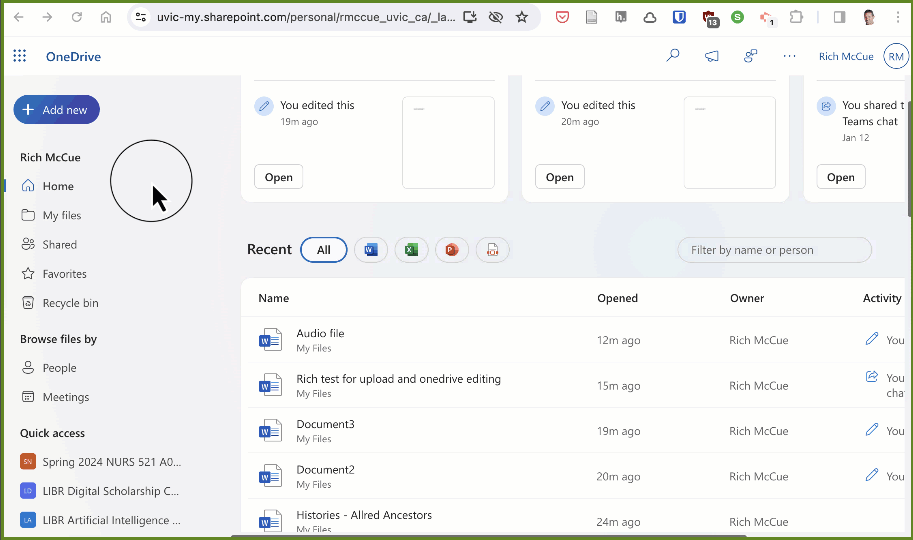
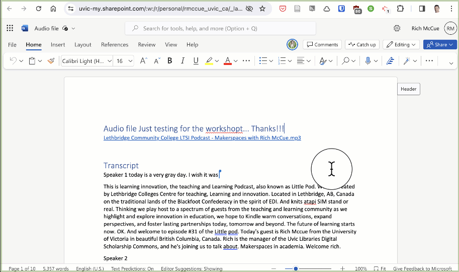

## Activity 3: Create Folders and Share
-  Create a folder and move a document to new folder
    <button onclick="toggle('gif1')">Show / Hide Animation </button>
 

 
  

-  [Share the document with someone else](https://support.microsoft.com/en-us/office/share-onedrive-files-and-folders-9fcc2f7d-de0c-4cec-93b0-a82024800c07#:~:text=Just%20right%2Dclick%20the%20file,you%20want%20to%20send%20it.){:target="_blank"}  (preferably with someone sitting near by you so that you can collaboratively edit the document in the next step)
    <button onclick="toggle('gif2')">Show / Hide Animation </button>
 

 
  

-  Collaboratively edit the document with another person
 <button onclick="toggle('gif3')">Show / Hide Animation </button>
 

 
  

-  Share the same document with another person with read-only or review permissions

  <button onclick="toggle('gif4')">Show / Hide Animation </button>
 

 
  

  

[NEXT STEP: Tag and Share](tag-share.html){: .btn .btn-blue }
