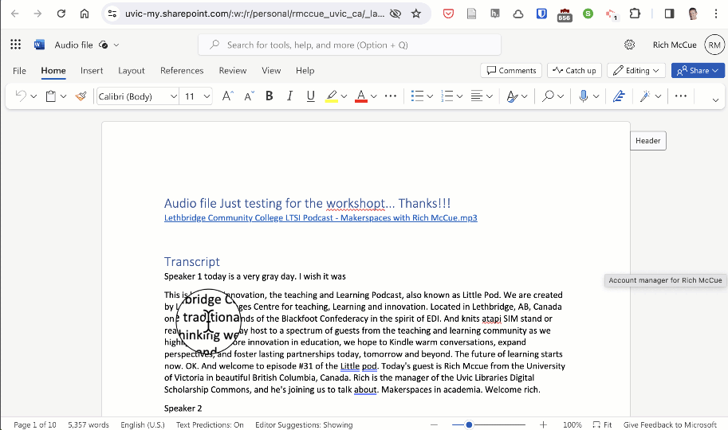

## Activity 4: Tag and Share
-  Use @mention in comments to tag someone for feedback
 <button onclick="toggle('gif1')">Show / Hide Animation </button>
 

 
  

  
-  See files you shared with you AND by you in OneDrive

 <button onclick="toggle('gif2')">Show / Hide Animation </button>
 

 
  

  

[Optional activities](optional-activities.html){: .btn .btn-blue }or 
[NEXT STEP: Informal Credentials](informal-credentials.html){: .btn .btn-blue }
